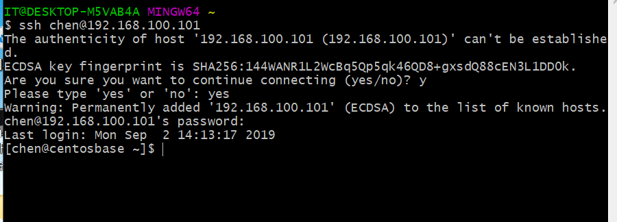

## ex1 实验报告：私有云的配置

1. 实验目的
- 初步了解虚拟化技术，理解云计算的相关概念
- 理解系统工程师面临的困境
- 理解自动化安装、管理（DevOps）在云应用中的重要性
 
    

  - 本实验需要一定的网络知识和系统方面经验，如无法独立完成，请积极与同学协作或到技术群咨询.

2. 实验环境与要求
- 实验需要硬件虚拟化（AMD-V 或 Intel-VT）支持，部分旧笔记本不支持。
- 本机配置
  - 处理器：intel(R) Core(TM) i5-7200U
- 用户通过互联网，使用微软远程桌面，远程访问你在PC机上创建的虚拟机
- 虚拟机操作系统 Centos，Ubuntu，或 你喜欢的 Linux 发行版，能使用 NAT 访问外网。

3. 实验内容
   1. 安装virtualBox
    官网下载：https://www.virtualbox.org/wiki/Download_Old_Builds_5_2
    版本 5.2.32 （要记住大概下载的是什么版本，后面需要安装对应的扩展）
    可参考网站安步骤下载：https://www.jianshu.com/p/dc0a9887b2c4

    安装完成后，需要对网卡进行配置
    打开virtualBox，点击上方工具栏的管理->主机网络管理器
    创建虚拟网卡，启动DHCP服务器，手动配置网卡
    网址按照要求分配为192.168.100.1（可自行改变，但后面虚拟机的网卡配置要相应改变）
    
    设置完成后，打开命令行，输入ipconfig命令，可以看到VirtualBox Host-Only Network #?: 的网卡。
    
    如果想自行对虚拟机的默认安装位置进行改变，可以进入VirtualBox菜单 ：管理 -> 全局设定，常规页面，进行设置
   2. 创建，安装虚拟机
     我选择的版本是 centOS Minimal ISO
     https://www.centos.org/download/
     先进入virtualBox，点击新建，将虚拟机命名为cent...(centosbase),以cent开头可自动识别系统，然后next，按照指导next，内存大小设置为4GB，选择现在创建虚拟磁盘，格式选择vdi。虚拟机存储大小分配为30GB，方便扩展。然后一直next，创建完成，然后选中虚拟机，先不要直接打开，在明细中的存储选项的控制器导入刚刚下载的iso镜像。然后打开虚拟机的设置->网络，网卡1为nat类型，不要改变她，选择网卡2，启用，选择仅主机（Host-Only）网络，和刚刚设置的虚拟网卡
     

     完成上述步骤后开机，然后按照向导安装即可。

     成功开机使用用户名和密码登录后，可以看到这个系统是一个命令行的系统，接下来通过命令继续进行网卡的配置。
    
    ---
    使用
     `sudo yum install wget` 输入密码后获取wget
     `yum update` 更新OS内核
        全部选择yes
     `sudo nmtui` 进入网络设置的UI界面
     配置第二快网卡enp0s8,ipv4设置为自动模式，address 为192.168.100.101/24，然后进入activate a connection 将enp0s8 激活，进入set system hostname可修改主机名
     
     

     完成后，在虚拟机ping 192.168.100.1 和外网，ping 通说明网络配置完成
        
     在主机ping 192.168.100.1 ，能ping通则进入下一步。

     复制虚拟机，勾选重新初始化所有网卡的MAC地址，选择连接复制。

     完成复制后，进入复制虚拟机，具体操作如虚拟机1安装所示，进入nmtui网络设置则不同，address 设置为 192.168.100.102，其他都一样。将虚拟机命名为centostemp

     然后 centosbase ping 192.168.100.102
     centostemp ping 192.168.100.101，两者可以ping通。
    
     接下来就可以用ssh 登录
     以centosbase为例子
     `ssh username@xxx.xxx.xxx`
     `ssh chen@192.168.100.102`
     输入密码后即可成功登入
        
     在主机可以ping通 192.168.100.1 192.168.100.101 192.168.100.102
    
     可以在git bash使用ssh登录
        

    ##### 远程桌面登录

    关闭虚拟机
    安装扩展，在官网下载对应版本扩展
    https://download.virtualbox.org/virtualbox/5.2.32/Oracle_VM_VirtualBox_Extension_Pack-5.2.32.vbox-extpack
    在全局设置中添加扩展
     
    以centosbase为例

    设置->显示 -》远程桌面，启用服务，设置端口号5002

    

    在主机使用远程桌面登录
    使用地址为192.168.100.1:5002
    

    成功进入远程桌面
    

 ##### 安装图形界面

 `yum groupinstall "GNOME Desktop"`
 `systemctl set-default multi-user.target  //设置成命令模式
systemctl set-default graphical.target  //设置成图形模式`

##### 坑
前一天晚上弄完，隔天起来就发现无法打开虚拟机，报错，不能为虚拟电脑打开一个新任务，然后发现设置的虚拟网卡不见了
解决方法
找到...\Oracle\VirtualBox\drivers\network\netadp6\VBoxNetAdp6.inf  右键 安装，成功，然后要从新配置网卡，手动设置为192.168.100.1

实验心得
了解了如何搭建自己的私有云
参考了很多博客