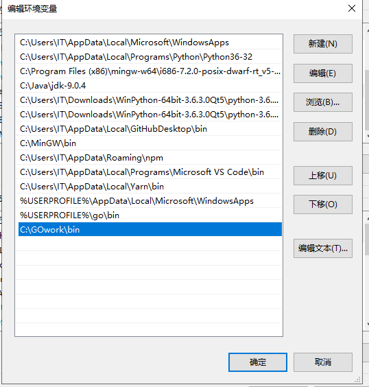
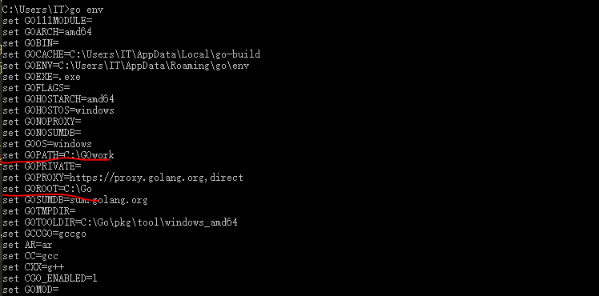
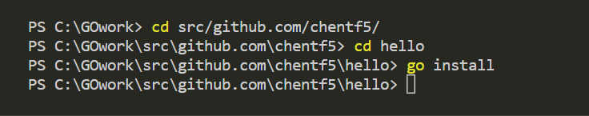
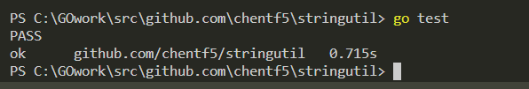

### GO在window10环境下的安装&使用

#### 一、安装

- 环境window10
- 下载：https://dl.google.com/go/go1.13.windows-amd64.msi
- 直接按照指引安装，安装路径，可以选择默认或自定义，但自定义待会需要自行配置环境变量，然后就可以完成。
- 检验是否成功安装，打开cmd，`C:\..\..> go version`,显示

    
    成功安装
- 关于环境变量的配置
    - GOROOT环境变量配置
    直接搜索编辑系统环境变量，点击右下角环境变量，新建，名字为GOROOT，值为GO的安装路径，如果安装路径默认为C盘，则可以不设置。
    
    - 工作空间

    go 工具为公共代码仓库中维护的开源代码而设计。 无论你会不会公布代码，该模型设置工作环境的方法都是相同的。

    Go代码必须放在工作空间内。它其实就是一个目录，其中包含三个子目录：

    src 目录包含Go的源文件，它们被组织成包（每个目录都对应一个包），
    pkg 目录包含包对象，
    bin 目录包含可执行命令。
    go 工具用于构建源码包，并将其生成的二进制文件安装到 pkg 和 bin 目录中。

    src 子目录通常包会含多种版本控制的代码仓库（例如Git或Mercurial）， 以此来跟踪一个或多个源码包的开发。

    
    以下例子展现了实践中工作空间的概念：
    ```
    bin/
        streak                         # 可执行命令
        todo                           # 可执行命令
    pkg/
        linux_amd64/
            code.google.com/p/goauth2/
                oauth.a                # 包对象
            github.com/nf/todo/
                task.a                 # 包对象
    src/
        code.google.com/p/goauth2/
            .hg/                       # mercurial 代码库元数据
            oauth/
                oauth.go               # 包源码
                oauth_test.go          # 测试源码
        github.com/nf/
            streak/
            .git/                      # git 代码库元数据
                oauth.go               # 命令源码
                streak.go              # 命令源码
            todo/
            .git/                      # git 代码库元数据
                task/
                    task.go            # 包源码
                todo.go                # 命令源码
    ```

    此工作空间包含三个代码库（goauth2、streak 和 todo），两个命令（streak 和 todo） 以及两个库（oauth 和 task）。

    命令和库从不同的源码包编译而来。稍后我们会对讨论它的特性。
    - GOPATH环境变量

    搜索编辑系统环境变量，点击右下角环境变量，找到环境变量中的GOPATH，如果没有自行新建，值为你工作空间的路径，这里我的工作空间的路径为 `C:\GOwork`
    

    还要在PATH中加入你工作空间下的bin目录的路径，找到环境变量PATH，双击进入后，在最后加上你的工作空间的bin的路径，我添加的路径是`C:\GOwork`
    

    然后可以在cmd里输入命令`go env`，可查看GOPATH和GOROOT是否设置成功
    

    接下来就可以在工作空间下开始使用go了。
#### 二、第一个程序
新建目录 src\github.com\chentf5\hello，进入hello，新建hello.go 文件 
```
package main

import "fmt"

func main() {
    fmt.Printf("hello, world\n")
}
```
可以打开vscode的终端，快捷键ctrl+` ，直接编译运行

`go run hello.go`


也可以用 go 工具构建并安装此程序

```
go install github.com/user/hello

cd $GOPATH/src/github.com/user/hello
go install
```


会在bin文件夹中生成可执行文件 hello.exe

输入路径 `$GOPATH/bin/hello`

可以运行

完成第一个程序

#### 三、第一个包
- 接下来编写一个库并让hello程序使用它
- 创建目录 src/github.com/user/stringutil，进入目录
- 创建文件stringutil.go

```
// stringutil 包含有用于处理字符串的工具函数。
package stringutil

// Reverse 将其实参字符串以符文为单位左右反转。
func Reverse(s string) string {
	r := []rune(s)
	for i, j := 0, len(r)-1; i < len(r)/2; i, j = i+1, j-1 {
		r[i], r[j] = r[j], r[i]
	}
	return string(r)
}
```

可以先只进行编译 `go build github.com/user/stringutil`

这不会产生输出文件。想要输出的话，必须使用 go install 命令，它会将包的对象放到工作空间的 pkg 目录中。

确认 stringutil 包构建完毕后，修改原来的 hello.go 文件（它位于 $GOPATH/src/github.com/user/hello）去使用它：
```
package main

import (
	"fmt"

	"github.com/user/stringutil"
)

func main() {
	fmt.Printf(stringutil.Reverse("!oG ,olleH"))
}
```

直接
`go install github.com/chentf5/hello`
    `./bin/hello`


#### 测试
可以写测试文件测试stringutil.go 中的逆转函数是否能够正确运行
在stringutil目录下，新建文件reverse_test.go
```
package stringutil

import "testing"

func TestReverse(t *testing.T) {
	cases := []struct {
		in, want string
	}{
		{"Hello, world", "dlrow ,olleH"},
		{"Hello, 世界", "界世 ,olleH"},
		{"", ""},
	}
	for _, c := range cases {
		got := Reverse(c.in)
		if got != c.want {
			t.Errorf("Reverse(%q) == %q, want %q", c.in, got, c.want)
		}
	}
}
```

` go test github.com/user/stringutil`
成功运行


#### 远程包