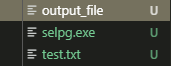
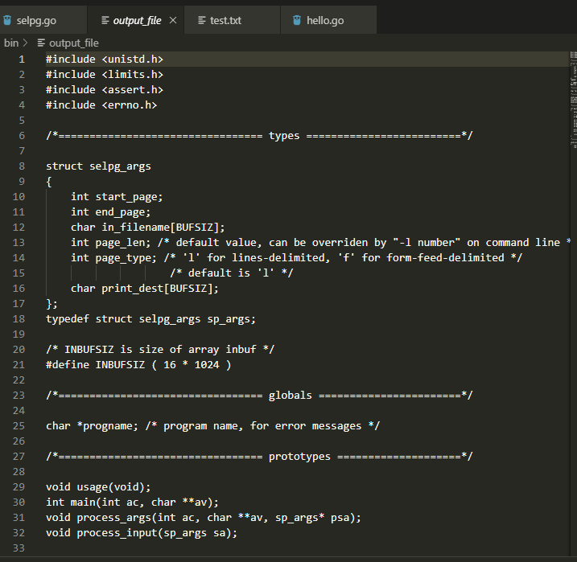

## CLI 命令行实用程序开发基础

#### 一、实验目的

使用 golang 开发 [开发 Linux 命令行实用程序](https://www.ibm.com/developerworks/cn/linux/shell/clutil/index.html) 中的 **selpg**

提示：

1. 请按文档 **使用 selpg** 章节要求测试你的程序
2. 请使用 pflag 替代 goflag 以满足 Unix 命令行规范， 参考：[Golang之使用Flag和Pflag](https://o-my-chenjian.com/2017/09/20/Using-Flag-And-Pflag-With-Golang/)
3. golang 文件读写、读环境变量，请自己查 os 包
4. “-dXXX” 实现，请自己查 `os/exec` 库，例如案例 [Command](https://godoc.org/os/exec#example-Command)，管理子进程的标准输入和输出通常使用 `io.Pipe`，具体案例见 [Pipe](https://godoc.org/io#Pipe)


#### 二、selpg简介

- selpg 程序逻辑

  selpg 是从文本输入选择页范围的实用程序。该输入可以来自作为最后一个命令行参数指定的文件，在没有给出文件名参数时也可以来自标准输入。

  selpg 首先处理所有的命令行参数。在扫描了所有的选项参数（也就是那些以连字符为前缀的参数）后，如果 selpg 发现还有一个参数，则它会接受该参数为输入文件的名称并尝试打开它以进行读取。如果没有其它参数，则 selpg 假定输入来自标准输入。

- 参数处理

  - **“-sNumber”和“-eNumber”强制选项**

    selpg 要求用户用两个命令行参数“-sNumber”（例如，“-s10”表示从第 10 页开始）和“-eNumber”（例如，“-e20”表示在第 20 页结束）指定要抽取的页面范围的起始页和结束页。selpg 对所给的页号进行合理性检查；

    ex: `$ selpg -s10 -e20 ...`

  - **“-lNumber”和“-f”可选选项**

    selpg 可以处理两种输入文本：

    *类型 1：*该类文本的页行数固定。这是缺省类型，因此不必给出选项进行说明。也就是说，如果既没有给出“-lNumber”也没有给出“-f”选项，则 selpg 会理解为页有固定的长度（每页 72 行）。

    ex `selpg -s10 -e20 -l66 ...`   每页为66行

    *类型 2：*该类型文本的页由 ASCII 换页字符（十进制数值为 12，在 C 中用“\f”表示）定界。该格式与“每页行数固定”格式相比的好处在于，当每页的行数有很大不同而且文件有很多页时，该格式可以节省磁盘空间。在含有文本的行后面，类型 2 的页只需要一个字符 ― 换页 ― 就可以表示该页的结束。打印机会识别换页符并自动根据在新的页开始新行所需的行数移动打印头。

    ex   `$ selpg -s10 -e20 -f ...`

    该命令告诉 selpg 在输入中寻找换页符，并将其作为页定界符处理。

    “-lNumber”和“-f”选项是互斥的。

  - **“-dDestination”可选选项：**
    selpg 还允许用户使用“-dDestination”选项将选定的页直接发送至打印机。这里，“Destination”应该是 lp 命令“-d”选项（请参阅“man lp”）可接受的打印目的地名称。该目的地应该存在 ― selpg 不检查这一点。在运行了带“-d”选项的 selpg 命令后，若要验证该选项是否已生效，请运行命令“lpstat -t”。该命令应该显示添加到“Destination”打印队列的一项打印作业。如果当前有打印机连接至该目的地并且是启用的，则打印机应打印该输出。这一特性是用 `popen()` 系统调用实现的，该系统调用允许一个进程打开到另一个进程的管道，将管道用于输出或输入。在下面的示例中，我们打开到命令

    ```
    $ lp -dDestination
    ```

    的管道以便输出，并写至该管道而不是标准输出：

    ```
    selpg -s10 -e20 -dlp1
    ```

    该命令将选定的页作为打印作业发送至 lp1 打印目的地。您应该可以看到类似“request id is lp1-6”的消息。该消息来自 lp 命令；它显示打印作业标识。如果在运行 selpg 命令之后立即运行命令 `lpstat -t | grep lp1` ，您应该看见 lp1 队列中的作业。如果在运行 lpstat 命令前耽搁了一些时间，那么您可能看不到该作业，因为它一旦被打印就从队列中消失了

#### 三、程序设计

- 定义结构体记录当前参数

  ```
  type selpg_args struct {
  	start_page  int
  	end_page    int
  	in_filename string
  	dest        string
  	page_len    int
  	page_type   int
  }
  ```

- 全局变量

  ```
  var now_args selpg_args //记录参数
  var program_name string //程序名称
  var arg_n int //参数数量
  ```

- 使用os.Args 读入参数后，会记录在参数在一个string数组内，然后我们需要对这些参数进行判断和处理。定义一个process_args函数进行判断

  - 判断参数数量

    Usage是先前定义的输出错误信息的函数，

    ```
    func Usage() {
    	fmt.Println("\nUsage of selpg.")
    	fmt.Println("\tselpg -s=Number -e=Number [options] [filename]")
    	fmt.Println("\t-l:Determine the number of lines per page and default is 72.")
    	fmt.Println("\t-f:Determine the type and the way to be seprated.")
    	fmt.Println("\t-d:Determine the destination of output.")
    	fmt.Println("\t[filename]: Read input from this file.")
    	fmt.Println("\tIf filename is not given, read input from stdin. and Ctrl+D to cut out.")
    }
    
    ```

    

    ```
    if len(input_args) < 3 {
    		fmt.Fprintf(os.Stderr, "%s: not enough arguments\n", program_name)
    		Usage()
    		os.Exit(1)
    	}
    
    ```

    

  -  处理第一个参数 -sxx 开始的页面，并提取开始的页数

    ```
    if input_args[1][0] != '-' || input_args[1][1] != 's' {
    		fmt.Fprintf(os.Stderr,"%s: 1st arg should be -sstart_page\n",program_name)
    		Usage()
    		os.Exit(1)
    	}
    
    	sp, _ := strconv.Atoi(input_args[1][2:])
    	if sp < 1 {
    		fmt.Fprintf(os.Stderr, "%s: invalid start page %d\n", program_name, sp)
    		Usage()
    		os.Exit(1)
    	}
    	now_args.start_page = sp
    ```

    

  - 处理第二个参数 -exx 结束的页面,并提取结束的页数

    ```
    if input_args[2][0] != '-' || input_args[2][1] != 'e' {
    		fmt.Fprintf(os.Stderr, "%s: 2nd arg should be -eend_page\n", program_name)
    		Usage()
    		os.Exit(1)
    	}
    
    	ep, _ := strconv.Atoi(input_args[2][2:])
    	if ep < 1 || ep < sp {
    		fmt.Fprintf(os.Stderr, "%s: invalid end page %d\n", program_name, ep)
    		Usage()
    		os.Exit(1)
    	}
    	now_args.end_page = ep
    ```

    

  - 处理其他的参数 -l, -f -d，

    ```
    argindex := 3
    	for {
    		if argindex > arg_n - 1 || input_args[argindex][0] != '-'	{
    			break
    		}
    		switch input_args[argindex][4] {
    		case 'l':
    			//获取一页的长度
    			pl, _ := strconv.Atoi(input_args[argindex][2:])
    			if pl < 1 {
    				fmt.Fprintf(os.Stderr, "%s: invalid page length %d\n", program_name, pl)
    				Usage()
    				os.Exit(1)
    			}
    			now_args.page_len = pl
    			argindex++
    		case 'f':
    			if len(input_args[argindex]) > 2 {
    				fmt.Fprintf(os.Stderr, "%s: option should be \"-f\"\n", program_name)
    				Usage()
    				os.Exit(1)
    			}
    			now_args.page_type = 'f'
    			argindex++
    		case 'd':
    			if len(input_args[argindex]) <= 2 {
    				fmt.Fprintf(os.Stderr, "%s: -d option requires a printer destination\n", program_name)
    				Usage()
    				os.Exit(1)
    			}
    			now_args.dest = input_args[argindex][2:]
    			argindex++
    		default:
    			fmt.Fprintf(os.Stderr, "%s: unknown option", program_name)
    			Usage()
    			os.Exit(1)
    			
    		}
    	}
    ```

- 处理完参数需要执行命令的输出，将从标准输入或文件中获取输入然后输出到标准输出或文件中，可以重定向输出作为其他命令的输入。定义process_input 进行处理

  - -s和-e参数的实现，使用页数计数器，如果页面满足条件则计数器加一，然后判断页面是否在规定的范围内，不是则继续向下读入

  - -l参数的实现：从输入中每次读取一行，然后对每一行进行计数，当行数到达-l后的数字，页数增加，判断页数是否在范围内然后输出。

    -f参数的实现：当有-f参数时，将`sa.page_type`赋值为’f’，从输入中每次读取一行，如果一行的字符为’\f’则页数计数增加，判断页数是否在范围内然后输出。

    -d参数的实现：使用`os/exec`包，可以执行外部命令，将输出的数据作为外部命令的输入。使用`exec.Command`设定要执行的外部命令，`cmd.StdinPipe()`返回连接到command标准输入的管道pipe，`cmd.Start()`使某个命令开始执行，但是并不等到他执行结束

  ```
  if now_args.in_filename != "" {
  		inf, err := os.Open(now_args.in_filename)
  		if err != nil {
  			fmt.Println(err)
  			os.Exit(1)
  		}
  		line_count := 1
  		page_count := 1
  		fin := bufio.NewReader(inf)
  		for {
  			//读取输入文件中的一行数据
  			line, _, err := fin.ReadLine()
  			if err != io.EOF && err != nil {
  				fmt.Println(err)
  				os.Exit(1)
  			}
  			if err == io.EOF {
  				break
  			}
  			if page_count >= now_args.start_page && page_count <= now_args.end_page {
  				if now_args.dest == "" {
  					//打印到屏幕
  					fmt.Println(string(line))
  				} else {
  					//写入文件中
  					fmt.Fprintln(cmd_in, string(line))
  				}
  			}
  			line_count++
  			if now_args.page_type == 'l' {
  				if line_count > now_args.page_len {
  					line_count = 1
  					page_count++
  				}
  			} else {
  				if string(line) == "\f" {
  					page_count++
  				}
  			}
  		}
  		if now_args.dest != "" {
  			cmd_in.Close()
  			cmdBytes, err := ioutil.ReadAll(cmd_out)
  			if err != nil {
  				fmt.Println(err)
  			}
  			fmt.Print(string(cmdBytes))
  			//等待command退出
  			cmd.Wait()
  		}
  	} else {
  		//从标准输入读取内容
  		ns := bufio.NewScanner(os.Stdin)
  		line_count := 1
  		page_count := 1
  		out := ""
  
  		for ns.Scan() {
  			line := ns.Text()
  			line += "\n"
  			if page_count >= now_args.start_page && page_count <= now_args.end_page {
  				out += line
  			}
  			line_count++
  			if now_args.page_type == 'l' {
  				if line_count > now_args.page_len {
  					line_count = 1
  					page_count++
  				}
  			} else {
  				if string(line) == "\f" {
  					page_count++
  				}
  			}
  		}
  		if now_args.dest == "" {
  			fmt.Print(out)
  		} else {
  			fmt.Fprint(cmd_in, out)
  			cmd_in.Close()
  			cmdBytes, err := ioutil.ReadAll(cmd_out)
  			if err != nil {
  				fmt.Println(err)
  			}
  			fmt.Print(string(cmdBytes))
  			//等待command退出
  			cmd.Wait()
  		}
  	}
  ```

- 主函数调用使用这个selpg命令

  ```
  func main() {
  	input_args := os.Args
  	now_args.start_page = 1
  	now_args.end_page = 1
  	now_args.in_filename = ""
  	now_args.dest = ""
  	now_args.page_len = 20 //默认20行一页
  	now_args.page_type = 'l'
  	arg_n = len(input_args)
  	process_args(input_args)
  	process_input()
  }
  ```

  

#### 四、实验结果




